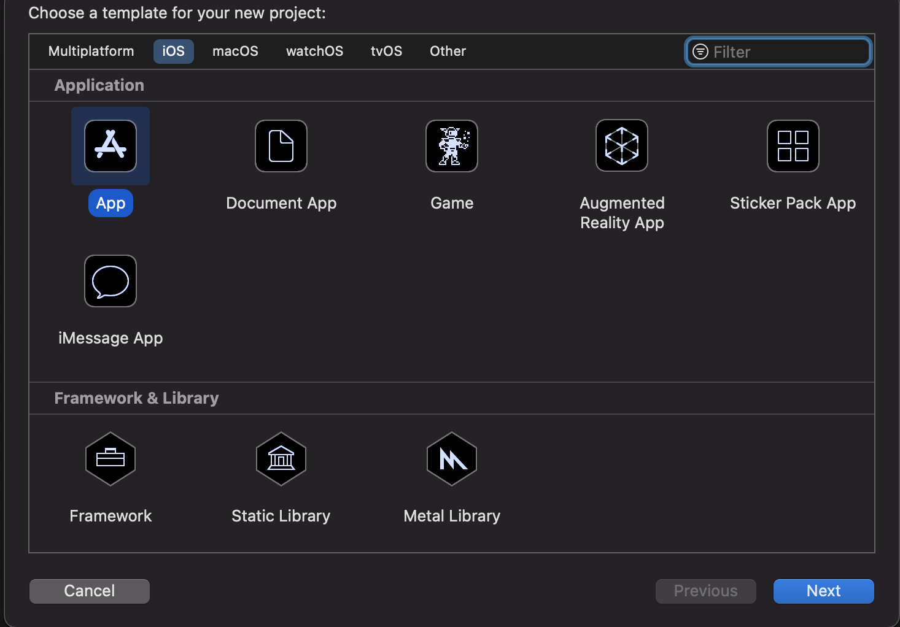
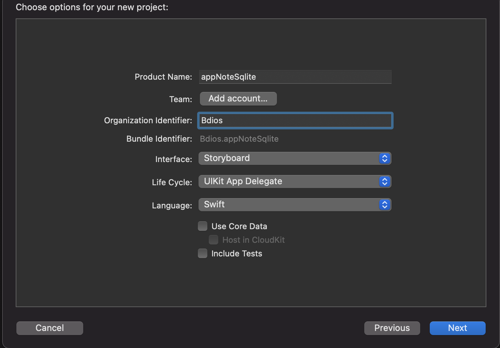
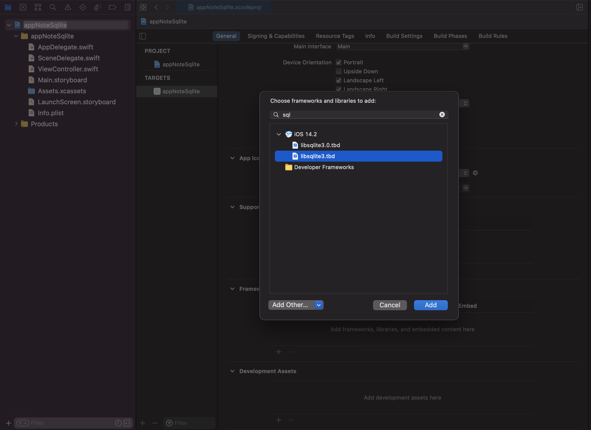
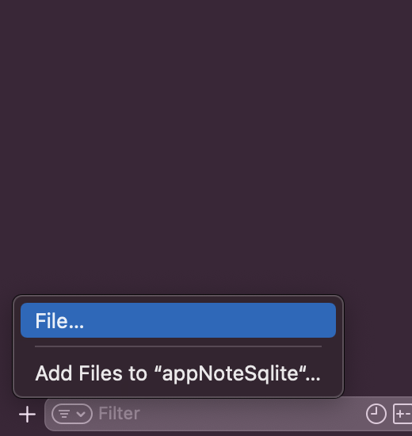
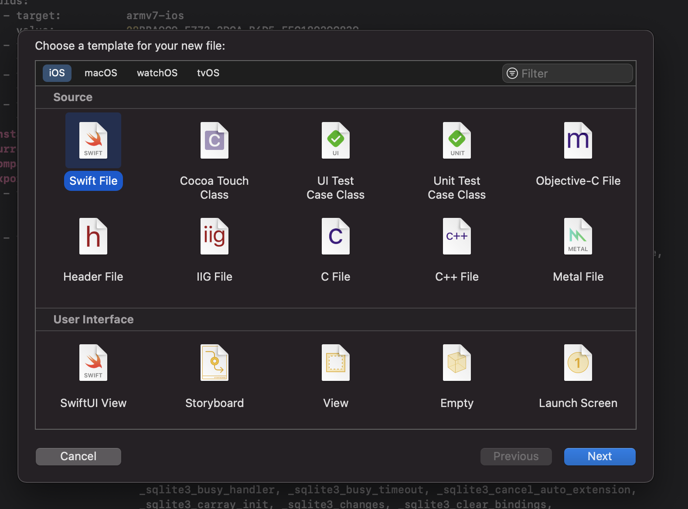
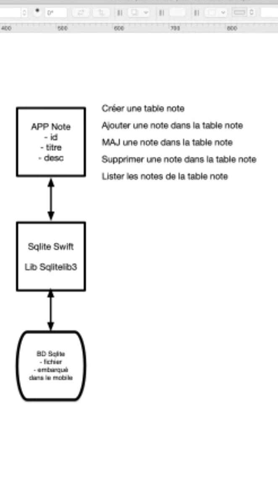

*** Natan charpentier ***
*** 2020-2021 ***
****
**BDiOS**
****
****
# AppNote with Sqlite Swift
****
## Créer un nouveau projet 
##AppNoteSqlite

# Mise en place 

## Selection du template


## Option du projet


## Ajout de Sqlite


## Ajout fichier swift pour Sqlite



## Schema de notre application


 ---
# Fichier SQlite
## Ouvrir une dataBase
### fichier Sqlite
On créer la base de donnée
````swift
// dans le fichier SQLITE
import Foundation
import SQLite3

class Sqlite{
/*
* A wrapper around an opaque C pointer
* see https://developer.apple.com/documentation/swift/opaquepointer
*/

var dbPtr: OpaquePointer? = nil
let sqlitePath: String

init?(path: String){
    sqlitePath = path
    dbPtr = self.openDatabase(path: sqlitePath)
}
    
    func openDatabase(path: String) -> OpaquePointer {
        var connectdb: OpaquePointer? = nil
        var dbStatus : Int32 = SQLITE_ERROR
        
        dbStatus = sqlite3_open(path, &connectdb)
        
        if dbStatus != SQLITE_OK {
            print("unable to open dataBase. Error: ", dbStatus)
        }
        return connectdb!
    }
    
}
`````
## Créer une table
````swift
// dans le fichier SQLITE
func createTable(_ tableName: String, columnInfo: [String]) -> Int32 {
        var dbStatus: Int32 = SQLITE_ERROR
        let sqlCmd: String = "create table if not exists \(tableName) " + "(\(columnInfo.joined(separator: ",")))"
        dbStatus = sqlite3_exec(dbPtr, String(sqlCmd), nil, nil, nil)
        
        if dbStatus == SQLITE_OK {
            print("table create ")
        }
        return dbStatus
    }
````

## Tester

- StoryBoard : button create ntables note
- class ViewController
 - liaison button dans la classe : action createTable
### fichier ViewController
## Initialiser la Bd 
- nous avons besoin du chemin absolue
- dans le constructeur de la classe *ViewController*
````swift
//Dans le viewController
 override func viewDidLoad(){
        super.viewDidLoad()
        do {
            let documentDirectory = try FileManager.default.url(for: .documentDirectory, in: .userDomainMask, appropriateFor: nil, create: true)
            let dbFileUrl = documentDirectory.appendingPathComponent("myNotes").appendingPathExtension("sqlite3")
            print(dbFileUrl.path)
            db = Sqlite(path: dbFileUrl.absoluteString)
        }catch{
            print("error")
        }
    }
````

````swift
//Dans le viewController
// on creer la table au click sur le bouton
    let dbTableName: String = "myNote"
    var db: Sqlite?

    @IBAction func createTable(_ sender: Any) {
        if db != nil {
            let dbStatus = db!.createTable(
                dbTableName,
                columnInfo: ["id integer primary key autoincrement",
                "title text",
                "desc text",
                "date_creation date"]
            )
        }
    }
````

## Inserer ligne dans une table
```Swift
// dans le fichier SQLITE
func insert(_ tableName: String, rowInfo: [String: String]) -> Int32 {
        var dbStatus: Int32 = SQLITE_ERROR
        
        let sqlCmd: String = "insert into \(tableName) "
            + "(\(rowInfo.keys.joined(separator: ",")))"
            + "values (\(rowInfo.values.joined(separator: ",")))"
        
        dbStatus = sqlite3_exec(self.dbPtr, String(sqlCmd), nil, nil, nil)
        
        return dbStatus
    }
```
### Tester
````Swift
//Dans le viewController
 @IBAction func InsertNote(_ sender: Any) {
        let alert = UIAlertController(title: "Insert Note", message: nil, preferredStyle: .alert)
                
                alert.addTextField { (tf) in tf.placeholder = "Title" }
                alert.addTextField { (tf) in tf.placeholder = "Descrption" }
                
                let action = UIAlertAction(title: "Save", style: .default) {
                    (action) in
                    guard let noteTitle = alert.textFields?.first?.text,
                        let noteDesc = alert.textFields?.last?.text
                        else {return}
    
                    if self.db != nil {
                        let noteDateCreation = NSDate() as Date
                        let dbStatus = self.db!.insert("'\(self.dbTableName)'",
                            rowInfo: ["title":"'\(noteTitle)'",
                                "desc":"'\(noteDesc)'",
                                "date_creation":"'\(noteDateCreation)'"])
                        
                        if dbStatus == SQLITE_OK {
                            print("A new note is inserted")
                        } else {
                            print("Failed : insert note")
                        }
                    }
                } //fin du callback
        alert.addAction(action)
        present(alert, animated: true, completion: nil)
    }
````


## Lister toutes les lignes de la table
````Swift
// dans le fichier SQLITE
func fetch(_ tableName: String, cond: String?, sortBy order: String?, offset: Int?) -> OpaquePointer {
        var dbStatus: Int32 = SQLITE_ERROR;
        let rowCount = 15;
        var sqlCmd: String = "select * from \(tableName)"
        if let condition = cond {
            sqlCmd += " where \(condition)"
        }
        if let orderBy = order {
            sqlCmd += " order by \(orderBy)"
        }
        sqlCmd += " limit \(rowCount)"
        if let offsetNum = offset {
            sqlCmd += " offset \(offsetNum)"
        }
        
        var statement: OpaquePointer? = nil
        dbStatus = sqlite3_prepare_v2(self.dbPtr, String(sqlCmd),-1,&statement, nil)
        
        return statement!
    }
````
## Tester

````Swift
//Dans le viewController
@IBAction func listNote(_ sender: Any) {
        let statement = db!.fetch(self.dbTableName, cond: nil, sortBy: nil, offset: nil)
                
                while sqlite3_step(statement) == SQLITE_ROW {
                    let noteId = sqlite3_column_int(statement, 0)
                    let noteTitle = String(cString: sqlite3_column_text(statement, 1))
                    let noteDesc = String(cString: sqlite3_column_text(statement, 2))
                    let noteDateCreation = String(cString: sqlite3_column_text(statement, 3))
                    
                    print("""
                    --------------------
                    noteId : \(noteId),
                    title : \(noteTitle),
                    desc: \(noteDesc),
                    date: \(noteDateCreation)
                    --------------------
                    """)
                }
    }
````

## Update line 
```Swift
// dans le fichier SQLITE
func update(_ tableName: String, cond: String?, rowInfo: [String: String]) -> Int32 {
        
        var dbStatus: Int32 = SQLITE_ERROR
        
        var sqlCmd: String = "update \(tableName) set "
        var info: [String] = []
        for (key, value) in rowInfo {
            info.append("\(key) = \(value)")
        }
        sqlCmd += info.joined(separator: ",")
        if let condition = cond {
            sqlCmd += " where \(condition)"
        }
        
        var statement: OpaquePointer? = nil
        
        dbStatus = sqlite3_prepare_v2(self.dbPtr, String(sqlCmd),-1, &statement, nil)
        if dbStatus == SQLITE_OK && sqlite3_step(statement) == SQLITE_DONE {
            print("Update data sucess")
            return dbStatus
        }
        sqlite3_finalize(statement)
        return dbStatus
    }
```

## Tester

```Swift
//Dans le viewController
@IBAction func UpdateNote(_ sender: Any) {
        let alert = UIAlertController(title: "Update Note", message: nil, preferredStyle: .alert)
                
                alert.addTextField { (tf) in tf.placeholder = "Note Id" }
                alert.addTextField { (tf) in tf.placeholder = "Title" }
                
                let action = UIAlertAction(title: "Save", style: .default) {
                    (_) in
                    guard let noteId = Int((alert.textFields?.first?.text)!),
                        let noteTitle = alert.textFields?.last?.text
                        else {return}
                
                    if self.db != nil {
                        let dbStatus = self.db?.update(self.dbTableName,
                            cond: "id = '\(noteId)'",
                            rowInfo: ["title":"'\(noteTitle)'"])
                        
                        if dbStatus == SQLITE_OK {
                            print("A note : \(noteId) is updated")
                        } else {
                            print("Failed to update note : \(noteId)")
                        }
                    }
                } //fin du callback
                alert.addAction(action)
                present(alert, animated: true, completion: nil)
    }
```

## DElete Note
```Swift
// dans le fichier SQLITE
func delete(_ tableName: String, cond: String?) -> Int32 {
        var dbStatus: Int32 = SQLITE_ERROR
        
        var sqlCmd: String = "delete from \(tableName)"
        
        if let condition = cond {
            sqlCmd += " where \(condition)"
        }
        
        var statement: OpaquePointer? = nil
        dbStatus = sqlite3_prepare_v2(self.dbPtr, String(sqlCmd), -1, &statement, nil)
        if dbStatus == SQLITE_OK && sqlite3_step(statement) == SQLITE_DONE {
            print("Delete data sucess")
            return dbStatus
        }
        sqlite3_finalize(statement)
        return dbStatus
        
    }
```

## Tester
```swift
//Dans le viewController
    @IBAction func DeleteNote(_ sender: Any) {
        let alert = UIAlertController(title: "Delete Note", message: nil, preferredStyle: .alert)
                
                alert.addTextField { (tf) in tf.placeholder = "Note Id" }
                let action = UIAlertAction(title: "Save", style: .default) {
                    (_) in
                    guard let noteId = Int((alert.textFields?.first?.text)!)
                    else {return}
                
                    if self.db != nil {
                        let dbStatus = self.db?.delete(self.dbTableName,
                            cond: "id = '\(noteId)'")
                        
                        if dbStatus == SQLITE_OK {
                            print("A note : \(noteId) is deleteed")
                        } else {
                            print("Failed to delete note : \(noteId)")
                        }
                    }
                } //fin du callback
                alert.addAction(action)
                present(alert, animated: true, completion: nil)
    }
```

## Delete All
```swift
// dans le fichier SQLITE
    func deleteAll(_ tableName: String) -> Int32 {
            var dbStatus: Int32 = SQLITE_ERROR

            let sqlCmd: String = "delete from \(tableName)"

            var statement: OpaquePointer? = nil
            dbStatus = sqlite3_prepare_v2(self.dbPtr, String(sqlCmd), -1, &statement, nil)
            if dbStatus == SQLITE_OK && sqlite3_step(statement) == SQLITE_DONE {
                print("Delete data sucess")
                return dbStatus
            }
            sqlite3_finalize(statement)
            return dbStatus

        }
```

## Tester
```swift
//Dans le viewController
   @IBAction func deleteAllEvent(_ sender: Any) {
        let alert = UIAlertController(title: "Delete All Events", message: nil, preferredStyle: .alert)
        let actionDelete = UIAlertAction(title: "Delete", style: .destructive) {_ in
            if self.db != nil {
                let dbStatus = self.db?.deleteAll(self.dbTableName)
                
                if dbStatus == SQLITE_OK {
                    print("A all event : is delete ")
                } else {
                    print("Failed to delete all event")
                }
            }
        } //fin du callback
        alert.addAction(actionDelete)
        let actionCancel = UIAlertAction(title: "Cancel", style: .cancel) {_ in
            alert.dismiss(animated: true, completion: nil)
        } //fin du callback
        alert.addAction(actionCancel)
        present(alert, animated: true, completion: nil)
    }
```